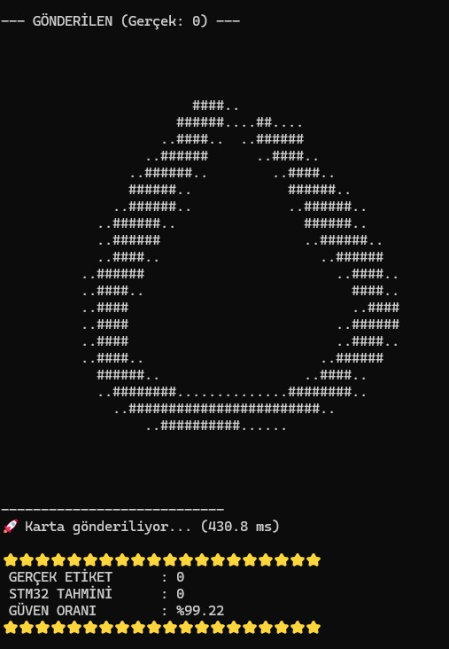
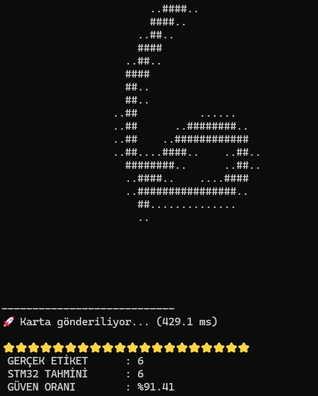
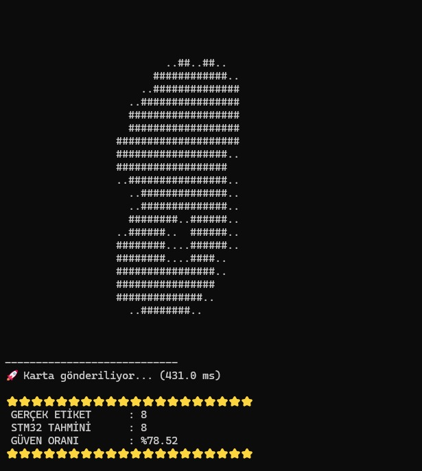
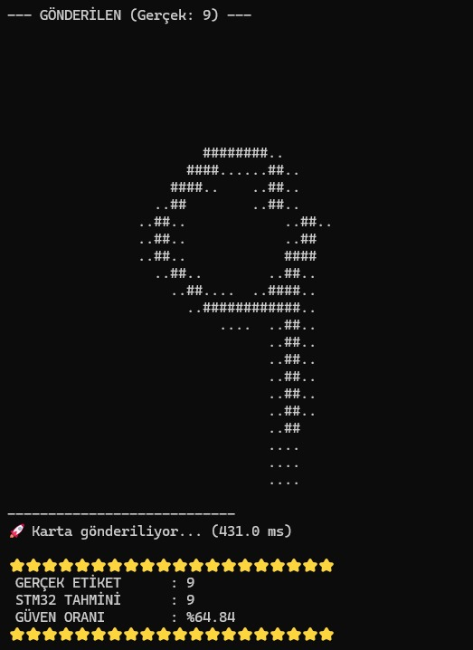
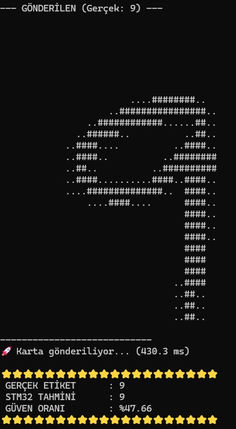

# Embeded-image-Processing-HW6
**Members:**
| Name               | Student ID |
|--------------------|--------------|
| **Eren Karagül**   | 150722007     |
| **Mehmet Akif Takcı** | 150721058   |

---
Handwritten Digit Recognition from Digital Images
---
In this homework we did Handwritten Digit Recognition from Digital images on STM32 Nucleo F767ZI  Using all CNN models. MobileNet, Resnet and EfficientNet. We use Google Collab to Gather our 3 Models. After that we use ST Edge AI to gather our project that we will use on STM32 Nucleo F767ZI board. Code That we used on Google Collab is given in the project.

After we upload the code that we gathered from ST Edge, we used the run.py code that we wrote to send images to the Nucleo board and gather our results. run.py code that we used is given in the project. And example results that we gathered from the NUCLEO board is given below.

  

  

  

  

  

